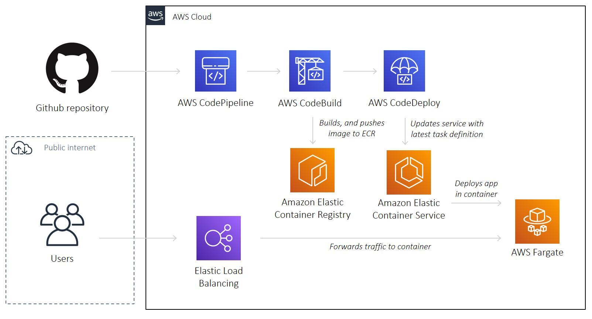

# AWS Fargate Node App

A reference project to deploy a Node Express app onto Amazon ECS on AWS Fargate with Terraform, inspired by [this](https://dev.to/txheo/a-guide-to-provisioning-aws-ecs-fargate-using-terraform-1joo) tutorial documentation



## Pre-requisite

Make sure you have installed [Terraform](https://learn.hashicorp.com/tutorials/terraform/install-cli), [AWS CLI](https://docs.aws.amazon.com/cli/latest/userguide/install-cliv2-mac.html#cliv2-mac-prereq), and configured a `default` AWS CLI profile (see doc [here](https://docs.aws.amazon.com/cli/latest/userguide/cli-configure-quickstart.html#cli-configure-quickstart-profiles))

```bash
terraform -help # prints Terraform options
which aws # prints /usr/local/bin/aws
aws --version # prints aws-cli/2.0.36 Python/3.7.4 Darwin/18.7.0 botocore/2.0.0
aws configure # configure your AWS CLI profile
```

## Configuration

Create a Github project, and generate a personal access token (see doc [here](https://docs.github.com/en/github/authenticating-to-github/creating-a-personal-access-token))

Populate `deploy/00-variables.tf`

```bash
variable "github_token" {}

variable "github_username" {
  default = "your_github_username"
}

variable "github_project_name" {
  default = "your_github_project_name"
}
# and a few more variables...
```

## Deploy

```bash
cd deploy # change to deploy directory
terraform init # initialises Terraform
terraform apply # deploys AWS stack. See output for AWS loadbalancer DNS name
terraform destroy # destroys AWS stack
```

When prompted for `github_token`, provide the value and hit Return

## Contributing

Pull requests are welcome. For major changes, please open an issue first to discuss what you would like to change.

Please make sure to update tests as appropriate.

## License

[MIT](https://choosealicense.com/licenses/mit/)
