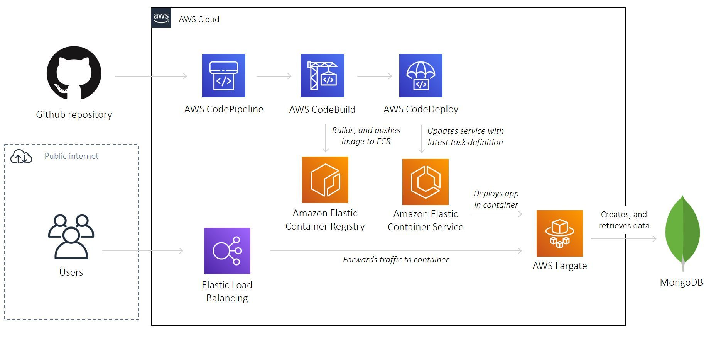

# AWS Fargate Node App

A reference project to deploy a Node Express app onto Amazon ECS on AWS Fargate with Terraform, inspired by [this](https://dev.to/txheo/a-guide-to-provisioning-aws-ecs-fargate-using-terraform-1joo) tutorial documentation

A microservice which creates, and authenticates users from a MongoDB database



## Pre-requisite

- Make sure you have installed [Terraform](https://learn.hashicorp.com/tutorials/terraform/install-cli), [AWS CLI](https://docs.aws.amazon.com/cli/latest/userguide/install-cliv2-mac.html#cliv2-mac-prereq), and configured a `default` AWS CLI profile (see doc [here](https://docs.aws.amazon.com/cli/latest/userguide/cli-configure-quickstart.html#cli-configure-quickstart-profiles))

```bash
terraform -help # prints Terraform options
which aws # prints /usr/local/bin/aws
aws --version # prints aws-cli/2.0.36 Python/3.7.4 Darwin/18.7.0 botocore/2.0.0
aws configure # configure your AWS CLI profile
```

- You have created a database on [MongoDB Atlas](https://www.mongodb.com/cloud/atlas) and have obtained a database connection string

## Configuration

- Create a Github project, and generate a personal access token (see doc [here](https://docs.github.com/en/github/authenticating-to-github/creating-a-personal-access-token))

- Create an [S3 bucket](https://www.terraform.io/docs/language/settings/backends/s3.html) to store Terraform state. Populate bucket name in `01-main.tf`

- Create a secret on [AWS Secrets Manager](https://aws.amazon.com/secrets-manager/) named `DockerHubAccessToken` with key `DOCKER_HUB_ACCESS_TOKEN`, and your [Docker access token](https://docs.docker.com/docker-hub/access-tokens/) as value

- Create a secret on [AWS Secrets Manager](https://aws.amazon.com/secrets-manager/) named `MongoPassword` with key `MONGO_PASSWORD`, and your MongoDB password as value

- Populate `terraform.tfvars`:

```bash
default_region            = "us-east-1"
docker_username           = "matlau"
github_username           = "MatthewCYLau"
github_project_name       = "node-aws-fargate-terraform"
app_name                  = "node-aws-fargate-app"
environment               = "staging"
mongo_username            = "admin-matlau"
mongo_host                = "mattewcylau-5ltcp.mongodb.net"
mongo_database_name       = "node-aws-fargate-app"
mongo_password_secret_arn = <MongoPassword Secret ARN>
```

## Deploy

```bash
cd deploy # change to deploy directory
terraform init # initialises Terraform
terraform apply # deploys AWS stack. See output for AWS loadbalancer DNS name
terraform destroy # destroys AWS stack
```

When prompted for `github_token`, provide the value and hit Return. Alternatively, create a [local environment variable](https://www.terraform.io/docs/language/values/variables.html#environment-variables) named `TF_VAR_github_token`

## Usage

- Create a user by making `POST` request to `/api/users` with the following JSON body:

```json
{
  "email": "jon@doe.com",
  "password": "password",
  "name": "jondoe"
}
```

- See Postman collection [here](https://www.getpostman.com/collections/471ace71d8c991681342)

## Contributing

Pull requests are welcome. For major changes, please open an issue first to discuss what you would like to change.

Please make sure to update tests as appropriate.

## License

[MIT](https://choosealicense.com/licenses/mit/)
